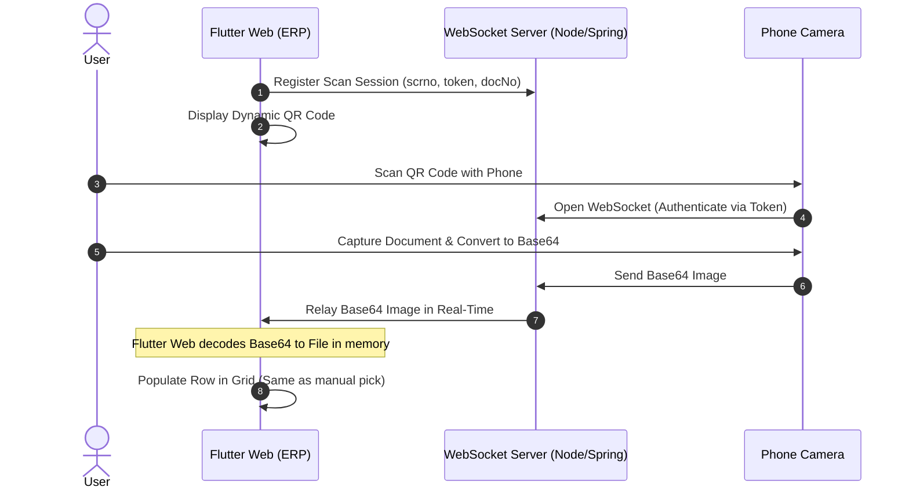

# Proposal: Real-Time Mobile Document Scanner for ERP
**Goal:** Implement a real-time mobile camera scanner for our Flutter Web ERP using a WebSocket microservice (Node.js or Spring Boot).

---

## 1. Executive Summary
Currently, ERP users must manually scan documents, save them to a PC, and upload them. We propose adding a dynamic QR code on the ERP screen. The user scans it with their phone, captures the document, and the image is instantly sent via WebSockets to their web browser—populating the active data grid row in real-time, behaving exactly like a manual file picker.

---

## 2. Why Firebase is Not Enough
* **High Costs:** Sending raw base64 images through Firestore generates heavy database read/write fees.
* **Storage Clutter:** Scanned images are temporary until the user clicks "Save". Storing abandoned scans in Firebase Storage wastes space.
* **Low Latency:** WebSockets provide direct, sub-second peer-to-peer connection to pair the phone and web browser instantly with zero database load.

---

## 3. How the Scanner Flow Works



### Simple Step-by-Step:
1. **ERP displays QR Code:** Contains screen number (`scrno`), unique session `token`, and document number (`docNo`).
2. **User scans with phone:** Opens a web link that activates the camera.
3. **Capture & Send:** The phone captures the image, converts it to a Base64 string, and streams it via WebSocket.
4. **Instant Conversion in Flutter Web:** The ERP web app receives the Base64, decodes it into bytes at runtime, wraps it as a standard `File` object in memory, and adds it to the grid row. 
5. **Ready for Backend:** Once populated in the grid, the converted file is ready to be handled or uploaded just like a standard local file.

---

## 4. Flutter Web Runtime Conversion (No changes to save logic)

The Flutter ERP converts the Base64 string directly into an in-memory `XFile`. This ensures the downstream upload logic remains completely unchanged:

```dart
import 'dart:convert';
import 'dart:typed_data';
import 'package:cross_file/cross_file.dart';

// Converts the received base64 string to a standard File object in memory
XFile convertBase64ToXFile(String base64String, String fileName) {
  String cleanBase64 = base64String.contains(',') ? base64String.split(',').last : base64String;
  Uint8List bytes = base64.decode(cleanBase64);
  return XFile.fromData(bytes, name: fileName, mimeType: 'image/jpeg');
}
```

---

## 5. Backend Service: Node.js vs. Spring Boot

We need a lightweight service to act as the real-time coordinator between the phone and the ERP browser tab:

| Metric | Node.js (Recommended) | Spring Boot |
| :--- | :--- | :--- |
| **Development Speed** | **Ultra-Fast** - Very simple to write and deploy. | **Standard** - Requires typical Java boilerplate. |
| **Memory Footprint** | **Very Low** - Single-threaded event loop is perfect for message passing. | **Higher** - Requires running a Java Virtual Machine (JVM). |
| **Integration** | Acts as an independent, lightweight real-time proxy. | Native fit if our core ERP backend is already Java/Spring. |
